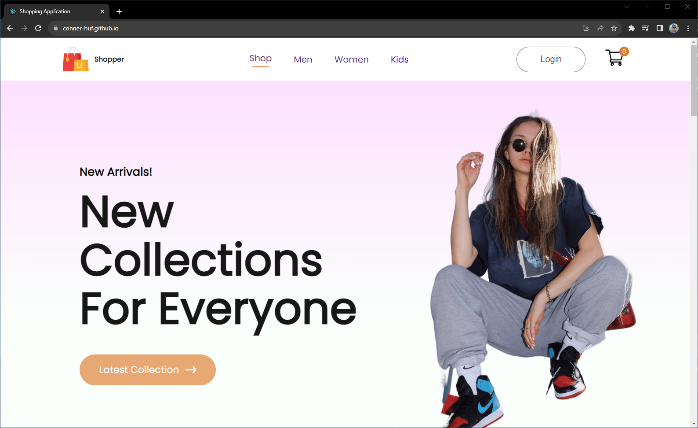
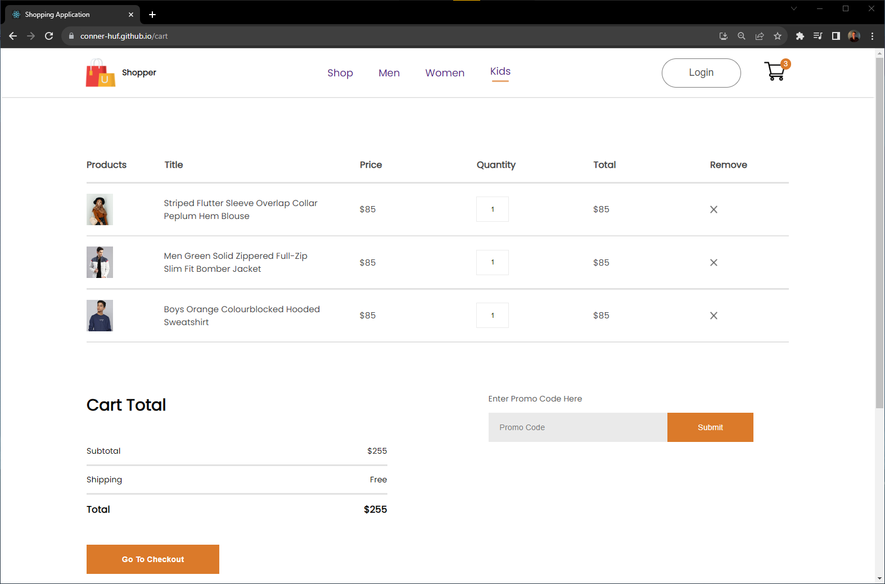

# E-Commerce Site Demo

Built using:
- React.js
- Node.js

This is a demo of an e-commerce site where the user can view categories of products, add products to their cart, and visit the checkout page to see a summary and total price of items in their cart. 

The application uses contexts to map through a json file of the available items, and renders items based on what category the user has selected. Below is a screenshot of the checkout page displaying the items summary and the total price.

~~This project is currently in development (10/15/2023). Working on fixing bug with shopping cart not displaying total cost correctly.~~
Bug fixed

## Update 10/23/23:
This bug was tough to find, but it's finally fixed. My getTotalCartAmount() function was rendering the total inside of its loop iterating over the cart items. Super simple - moving the return out of the loop - fixed it.

### Deployment

This section has moved here: [https://facebook.github.io/create-react-app/docs/deployment](https://facebook.github.io/create-react-app/docs/deployment)

### `npm run build` fails to minify

This section has moved here: [https://facebook.github.io/create-react-app/docs/troubleshooting#npm-run-build-fails-to-minify](https://facebook.github.io/create-react-app/docs/troubleshooting#npm-run-build-fails-to-minify)
